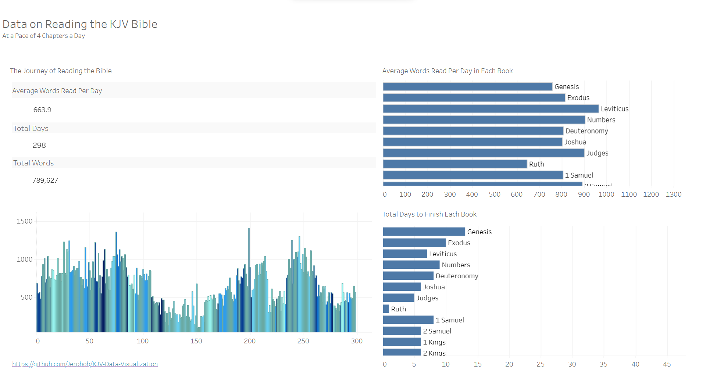

# KJV-Data-Visualization
### Project Description
>>>A visualization of some data analysis on the KJV (1611 King James Authorized Version) Bible. 

## Technology used

| Technology | Description | 
|------------|-------------|
| Postgres   | Database Engine |
| Docker     | Creates/deploys applications on virtualized containers |
| Python     | High Level, Dynamic Language |
| SQL        | Programming Language for processing and storing information in a relational database |
| TODO: Tableau | Data visualization tool |

## Python Libraries 
* Pandas: used for analyzing, cleaning, exploring, and manipulating data.
* NumPy: used for working with arrays and scientific computing
## Get Started
### Install Docker [here](https://www.docker.com/get-started/)
TODO: Implement a dockerfile to create a python image
But for now
### Install Python [here](https://www.python.org/downloads/)
Then in your directory of choice, clone the repository

```
git clone git@github.com:Jerpbob/KJV-Data-Visualization.git
```

Then enter into the project root directory

```
cd KJV-Data-Visualization
```

Then used docker compose to start up your postgres container

```
docker compose up -d
```

You can then copy and paste the sql from bible_tables.sql and follow the comments to create the tables in your db

For more complex operations, I used pandas and numpy from Python, so let's get that started too.

Create a virtual environment.
```
python3 -m venv env
```

Then activate your virtual environment

```
activate source env/bin/activate
```

Then install both pandas and numpy (when you install pandas numpy is installed as well) 

```
pip install pandas
```

Then you can run 
```
python3 main.py
``` 
to run the python script to see the dataframes and mess around with them.

## Schema from bible_tables.sql


## Data Visualization/s


[link](https://public.tableau.com/app/profile/jeru.paul.balares/viz/KJV_4_Chapters_Per_Day/Dashboard1)